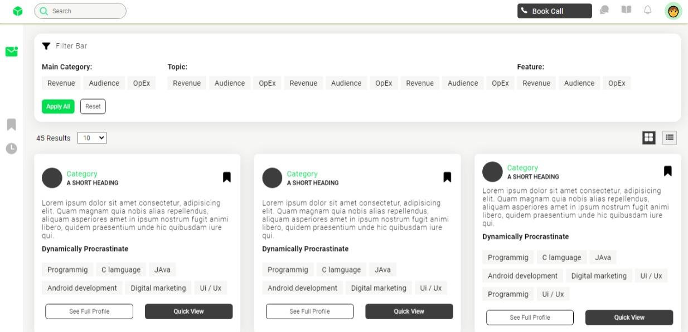
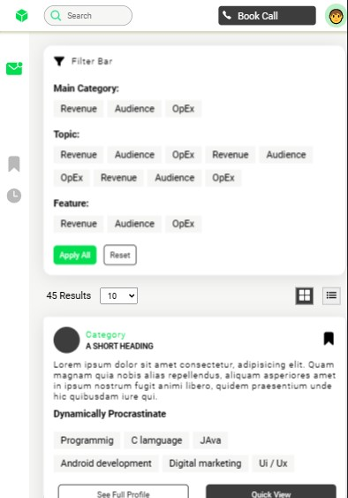

# Developer Details Website UI Clone
This project is a UI clone of the home page of a developer details website created using only pure HTML and CSS.




## Table of Contents

### Installation
To use or contribute to this project, you can follow these steps:

> Clone the repository:

```
git clone https://github.com/pavan6476252/html-css-ui-clone.git
```
> Navigate to the project directory:

```
cd html-css-ui-clone
```
Open the index.html file in your web browser.

Usage
This project is a simple HTML and CSS clone of the home page of a developer details website. You can use it to practice HTML and CSS or as a starting point for your own website design.

The website contains a header, navigation menu, hero section, about section, skills section, projects section, and footer. Each section is styled using CSS and contains sample content.

## Credits

The original website design inspiration was taken  from dribble.


